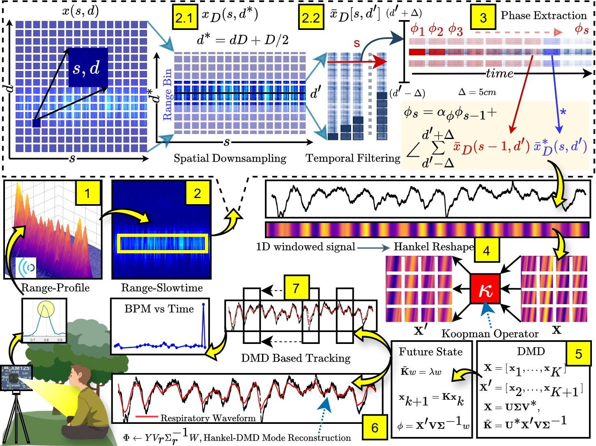
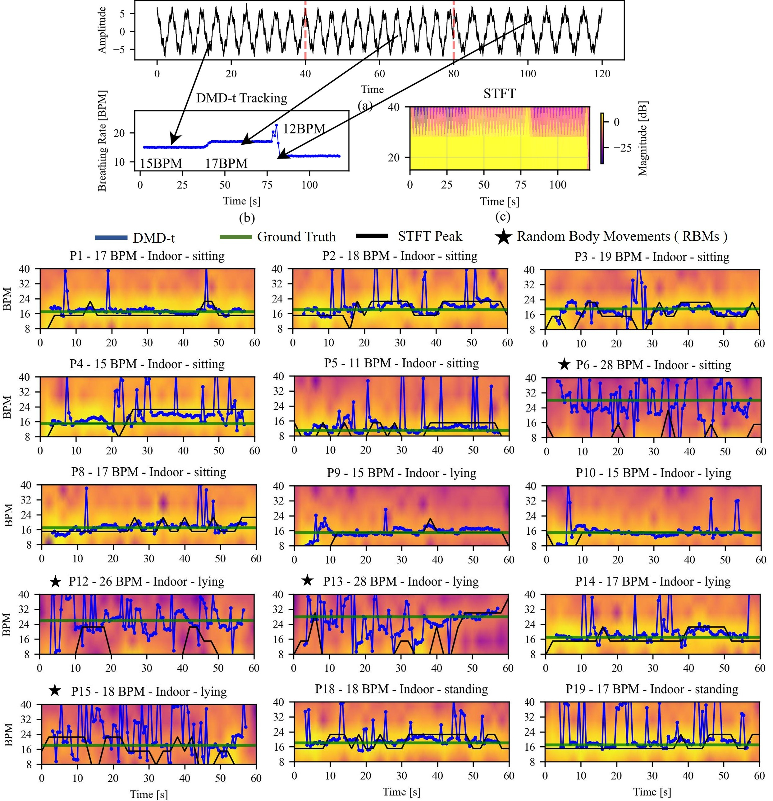

# Hankel Dynamic Mode Decomposition for Radar-Based Respiratory Sensing and Tracking

[](https://openreview.net/pdf?id=woYUswZOhF))
[](https://suhani92.github.io/HDMD-Respiratory-Rate/)
[](https://opensource.org/licenses/MIT)

Official implementation of **"Hankel Dynamic Mode Decomposition for Radar-Based Respiratory Sensing and Tracking"** accepted at NeurIPS 2025 Workshop on Learning to Sense.
> **Authors:** M Gopal Krishna*, Suhani Grover*, Chhavi Dhiman  
> **Affiliation:** Delhi Technological University  
> *Equal contribution


---

## Overview

This repository provides a robust framework for contactless respiratory monitoring using low-power mmWave radar and Hankel Dynamic Mode Decomposition (HDMD). Our method achieves **6.00% NRMSE indoors** and **1.33% NRMSE outdoors**, significantly outperforming baseline methods (VMD, EEMD, DWT) while maintaining robustness under random body movements.


*Figure 1: Overview of the HDMD pipeline for respiratory sensing. The system processes raw radar IQ data through phase extraction, Hankel embedding, DMD decomposition, and respiratory mode reconstruction.*

### Key Features

- Variation trend phase extraction without unwrapping artifacts
- Koopman operator-based modal decomposition for robust signal isolation
- Real-time respiratory rate variability tracking with DMD-t
- Privacy-preserving, lighting-independent sensing
- Validated across diverse indoor/outdoor environments

---

## Dataset

Our dataset contains recordings from 24 subjects across:
- 3 postures: sitting, standing, lying
- 2 environments: indoor and outdoor
- 3 antenna configurations: no lens, plano-convex lens, Fresnel Zone Plate

**To access the dataset:**
1. Fill out the [data request form](https://forms.gle/6PBNuKAtrfQfkXsC8)
2. Download from the provided Google Drive link

---

## Installation

### Requirements
- Python 3.8 or higher
- Acconeer XM125 radar module with A121 sensor
- USB cable for radar connection

### Setup
```bash
# Clone the repository
git clone https://github.com/Suhani92/HDMD-Respiratory-Rate.git
cd HDMD-Respiratory-Rate

# (Optional) Create conda environment
conda create -n hdmd python=3.8
conda activate hdmd

# Install Python dependencies
pip install -r requirements.txt

# Install Acconeer SDK
pip install --upgrade acconeer-exptool[app]>=4.9.0
```

**Note:** On some systems, you may need to use `pip3` instead of `pip`, or `python -m pip` for installation.

---

## Hardware Setup

### Initial Configuration

1. **Connect the radar module** via USB to your computer

2. **Install drivers** (if needed):
   - Windows: Driver should install automatically. If not, see [Acconeer documentation](https://docs.acconeer.com)
   - Linux: No driver needed, but you may need to add user to dialout group:
```bash
     sudo usermod -a -G dialout $USER
     # Log out and log back in for changes to take effect
```

3. **Run the setup wizard**:
```bash
   python -m acconeer.exptool.setup
```

4. **Launch Acconeer Exploration Tool**:
```bash
   python -m acconeer.exptool.app
```

5. **Configure connection**:
   - Select **A121** as sensor type
   - Set port type to **Serial**
   - Select port **XE125** (typically `/dev/ttyUSB0` on Linux or `COM#` on Windows)
   - Click **Connect**

### Flash the Radar (First-Time Setup Only)

If this is your first time using the radar module:

1. Navigate to the **Flash** tab in Exploration Tool
2. Select **Get latest binary for A121**
3. Put the radar in bootloader mode:
   - Press and hold the **DFU** button
   - Press the **RESET** button (while holding DFU)
   - Release **RESET**
   - Release **DFU**
4. Follow on-screen instructions to complete flashing
5. Press and release the **RESET** button after flashing completes

### Radar Configuration Parameters

Navigate to the **Stream** tab and select **Sparse IQ** service. Configure the following:

**Metadata:**
- Frame data length: `40`
- Max sweep rate: `2575 Hz`

**Processor Parameters:**
- Amplitude method: `Coherent`

**Sensor Parameters:**
- Sweeps per frame: `1`

**Subsweep Parameters:**
- Start point: `80`
- Number of points: `40`
- Step length: `8`
- HWAAS: `8`
- Profile: `3`
- Receiver gain: `16`
- PRF: `15.6 MHz`
- Enable transmitter: `✓`

**Recording:**
- Click **Start measurement** to begin data collection
- Save data as `.h5` file for processing

---

## Code Structure
```
HDMD-Respiratory-Rate/
├── core_hdmd/
│   ├── hdmd_breathing_estimation.py     # Main HDMD algorithm for breathing rate estimation from radar IQ data
│   ├── dmdt_tracking.py                 # Time-varying (DMD-t) tracking of respiratory rate; supports synthetic or real radar data
│   └── synthetic_signal_generation.py   # Generates synthetic mixed breathing + cardiac signals for testing and visualization
│
├── baselines/
│   ├── eemd_breathing_estimation.py     # Ensemble Empirical Mode Decomposition baseline
│   ├── vmd_breathing_estimation.py      # Variational Mode Decomposition baseline
│   └── dwt_breathing_estimation.py      # Discrete Wavelet Transform baseline
│
├── data/                                # (optional) Folder for radar .h5 files or synthetic signals
├── static/images/                       # Figures for documentation
└── README.md
```

### Code Descriptions
---

## Quick Start

### 1. Generate Synthetic Signal (Optional)
```bash
python hdmd_core/synthetic_signal_generation.py
```
Creates `synthetic_signal.npz` with breathing + cardiac components.

### 2. Run HDMD on Single Radar File
```bash
python hdmd_core/hdmd_breathing_estimation.py --file data/subject1.h5
```

### 3. Process Multiple Files
```bash
python hdmd_core/hdmd_breathing_estimation.py --folder data/ --output results.csv
```

### 4. Run DMD-t Tracking
```bash
# On synthetic signal
python hdmd_core/dmdt_tracking.py --mode synthetic --data_path synthetic_signal.npz

# On radar data
python hdmd_core/dmdt_tracking.py --mode radar --data_path data/subject1.npy --fs 300
```

### 5. Compare with Baseline Methods
```bash
# EEMD
python baselines/eemd_breathing_estimation.py --file data/subject1.h5

# VMD
python baselines/vmd_breathing_estimation.py --file data/subject1.h5

# DWT
python baselines/dwt_breathing_estimation.py --file data/subject1.h5
```

---

## Detailed Usage

### HDMD Breathing Estimation

**Basic usage:**
```bash
python hdmd_core/hdmd_breathing_estimation.py --file data/subject1.h5
```

**Batch processing:**
```bash
python hdmd_core/hdmd_breathing_estimation.py --folder data/ --output hdmd_results.csv
```

**Options:**
- `--file`: Path to single .h5 file
- `--folder`: Process all .h5 files in folder
- `--synthetic`: Use synthetic .npz signal
- `--output`: Output CSV filename (default: hdmd_results.csv)
- `--fs`: Sampling frequency in Hz (default: 300)
- `--m`: Hankel window size (default: 500)

**Output:** CSV file with columns: `file`, `hdmd_bpm`, `hdmd_time`

---

### DMD-t Tracking

**Synthetic signal:**
```bash
python hdmd_core/dmdt_tracking.py --mode synthetic --window_size 5.0 --step_size 1.0
```

**Radar data:**
```bash
python hdmd_core/dmdt_tracking.py --mode radar --data_path data/phase_signal.npy --fs 300
```

**Options:**
- `--mode`: 'synthetic' or 'radar'
- `--data_path`: Path to signal file (.npz, .npy, .csv, .mat)
- `--fs`: Sampling frequency (Hz)
- `--window_size`: Sliding window size in seconds (default: 5.0)
- `--step_size`: Step between windows in seconds (default: 1.0)
- `--rank`: Optional truncation rank for DMD
- `--save_dir`: Output directory (default: results/)

**Output:** 
- `dmdt_time_points.npy`: Time centers of each window
- `dmdt_bpm.npy`: Estimated breathing rate at each time point
- `dmdt_tracking.png`: Visualization plot

---

### Baseline Methods

All baseline scripts support the same basic interface:

```bash
python baselines/{method}_breathing_estimation.py --file data/subject1.h5 --fs 300
```

Replace `{method}` with `eemd`, `vmd`, or `dwt`.

**Method-specific options:**

**EEMD:**
- `--noise`: Noise width (default: 0.2)
- `--trials`: Number of ensemble trials (default: 100)

**VMD:**
- `--K`: Number of modes (default: 6)
- `--alpha`: Balancing parameter (default: 2000)

**DWT:**
- `--wavelet`: Wavelet type (default: 'db4')
- `--max_level`: Max decomposition level (default: 4)

---


## Method Overview

### Phase Extraction

The variation trend method computes continuous phase by tracking cumulative displacement:
```
φ[s] = α_φ · φ[s-1] + ∠(Σ x̄[s,d'] · x̄*[s-1,d'])
```

where `α_φ` acts as a high-pass filter to suppress low-frequency drift.

### Hankel-DMD Decomposition

1. **Hankel Matrix Construction**: Time-delayed embeddings create pseudo-spatiotemporal representation
2. **SVD-based DMD**: Approximates Koopman operator via `Y ≈ KX`
3. **Mode Selection**: Isolates respiratory modes (0.1-0.8 Hz range)
4. **Reconstruction**: Combines selected modes to recover the breathing waveform

### DMD-t Tracking


*Figure 3: DMD-t provides superior time-frequency resolution compared to STFT, enabling accurate tracking of respiratory rate variations.*

Sliding window DMD enables real-time tracking of time-varying respiratory rates. Each window produces local eigenvalues representing instantaneous breathing frequency.

---

## Results

### Performance Comparison

| Method | Indoor RMSE (BPM) | Indoor NRMSE (%) | Outdoor RMSE (BPM) | Outdoor NRMSE (%) |
|--------|-------------------|------------------|---------------------|-------------------|
| **HDMD** | **1.14** | **6.00** | **0.40** | **1.33** |
| VMD | 6.12 | 32.20 | 8.56 | 28.55 |
| EEMD | 4.68 | 24.60 | 3.81 | 12.71 |
| DWT | 9.27 | 48.80 | 13.40 | 44.66 |


### Computational Efficiency

| Method | Average Time (s) | Relative Speed |
|--------|-----------------|----------------|
| DWT | 0.004 | 1350× faster |
| VMD | 0.86 | 6.3× faster |
| **HDMD** | **5.4** | baseline |
| EEMD | 38.9 | 7.2× slower |

While HDMD has higher computational cost, it provides significantly better accuracy and robustness, particularly under challenging conditions with body movements.

---

## Troubleshooting

### Common Issues

**Radar not detected:**
- Ensure USB cable is properly connected
- Check that drivers are installed (Windows)
- Verify device appears in device manager/lsusb output
- Try a different USB port

**Phase extraction fails:**
- Verify `.h5` file structure matches expected format
- Check that radar was configured with correct parameters
- Ensure adequate signal quality (subject within 1.5-2m range)

**Poor breathing rate estimates:**
- Confirm subject is within optimal range (1.5-2m)
- Check for environmental interference or multipath
- Verify antenna lens is properly installed
- Try different posture if results are inconsistent

**Memory errors during processing:**
- Reduce embedding dimension `m` in Hankel matrix construction
- Process shorter signal segments
- Close other applications to free memory


---

## Contact

- M Gopal Krishna: mgopalkrishna0007@gmail.com
- Suhani Grover: suhani1077@gmail.com
- Chhavi Dhiman: chhavi.dhiman@dtu.ac.in

---

## License

This project is released under the MIT License. See `LICENSE` file for details.

**Note:** This implementation is intended for research purposes. Clinical applications require appropriate validation and regulatory compliance.

---
